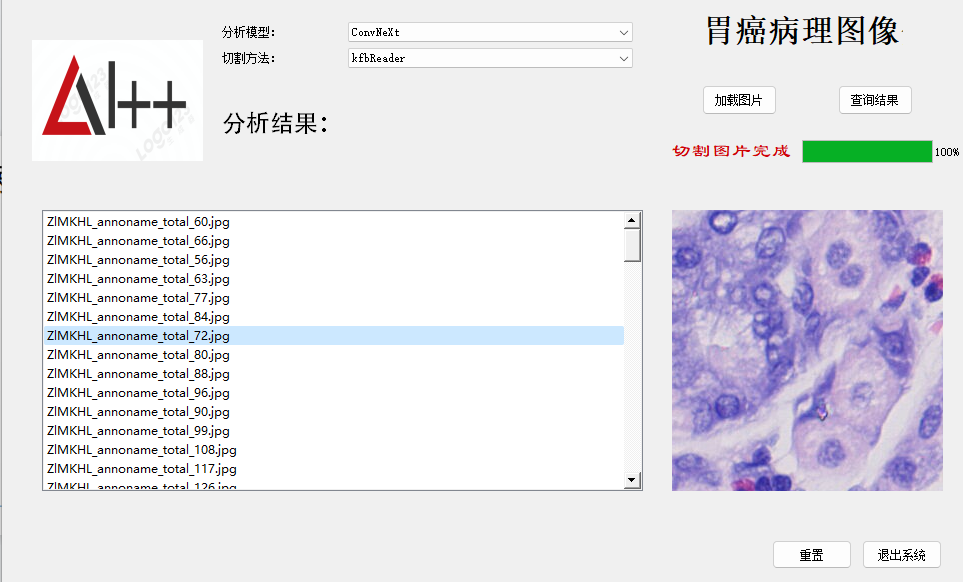
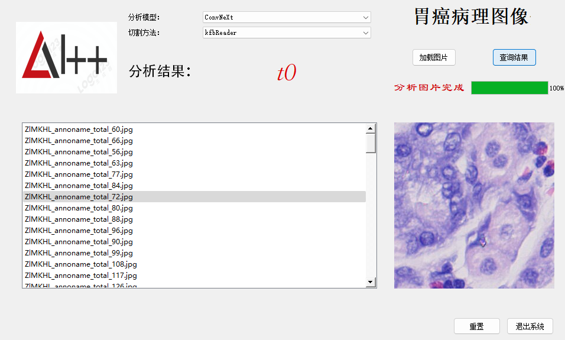

# 内容
帮助各位网友水水的过自己学校的软件课程，做的是一个胃癌检测系统，功能分别是切割图片和图片检测
最终会在界面上显示检测出来的胃癌类别(t0,t1,t2,t3,t4,t5)

## 图片分割功能展示


## 图片分析功能展示

# 使用方法
## 创建dataset目录
在./gastricCancer目录下
````
mkdir dataset && cd dataset 

mkdir kfb && mkdir tis
````
## 运行程序
直接运行program.py文件即可， 训练的代码未上传，测试图片和训练的pth文件放在网盘中
````
链接：https://pan.baidu.com/s/1zVgmAyFquqOTiL-8Eq8Zuw 
提取码：0m5l 
--来自百度网盘超级会员V4的分享
````